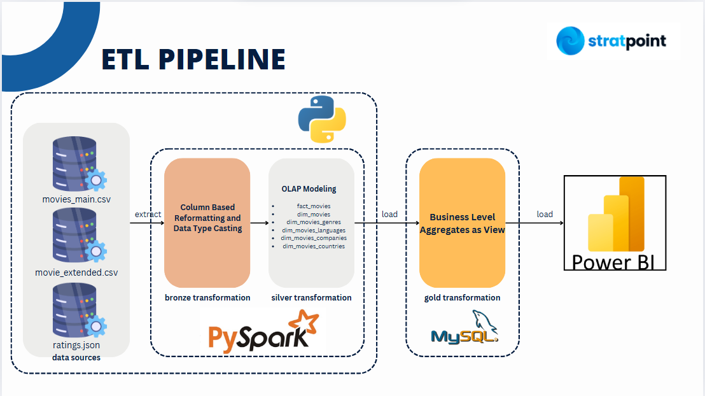

# 🎬 Movie Analytics Project

## 📊 Overview

This project builds an end-to-end ETL (Extract, Transform, Load) pipeline to process and analyze movie-related datasets. The goal is to transform raw data into a structured format that supports advanced business intelligence and visualization.

We use **PySpark** for large-scale data transformations, **MySQL** for storing processed data, and **Power BI** for final visual analytics.

---

## 🛠 ETL Pipeline Breakdown

### 1. Extract

- **Sources**:
  - `movies_main.csv`
  - `movie_extended.csv`
  - `ratings.json`
- Data is extracted from CSV and JSON files located in the `project_data/` folder.

---

### 2. Transform

#### 🔸 Bronze Layer

- **Objective**: Column-based reformatting and data type casting.
- **Tools**: PySpark
- **Actions**:
  - Clean inconsistent formats
  - Normalize data types (e.g., integers, timestamps)

#### 🔸 Silver Layer

- **Objective**: OLAP (Online Analytical Processing) Modeling.
- **Tools**: PySpark
- **Entities**:
  - `fact_movies`
  - `dim_movies`
  - `dim_movies_genres`
  - `dim_movies_languages`
  - `dim_movies_companies`
  - `dim_movies_countries`
- **Actions**:
  - Build star schema-like structures for efficient querying.

#### 🔸 Gold Layer

- **Objective**: Create business-level aggregates as views.
- **Tools**: MySQL
- **Actions**:
  - Generate high-level summarized views for analytics.
  - Prepare datasets for direct consumption in BI tools.

---

### 3. Load

- **Final Destination**:
  - MySQL Database (Gold Layer)
  - Power BI (for reporting and dashboard creation)

---

## ⚙️ Technologies Used

- **PySpark** — distributed data processing
- **Python** — ETL scripting
- **MySQL** — data storage
- **Power BI** — visualization and dashboarding
